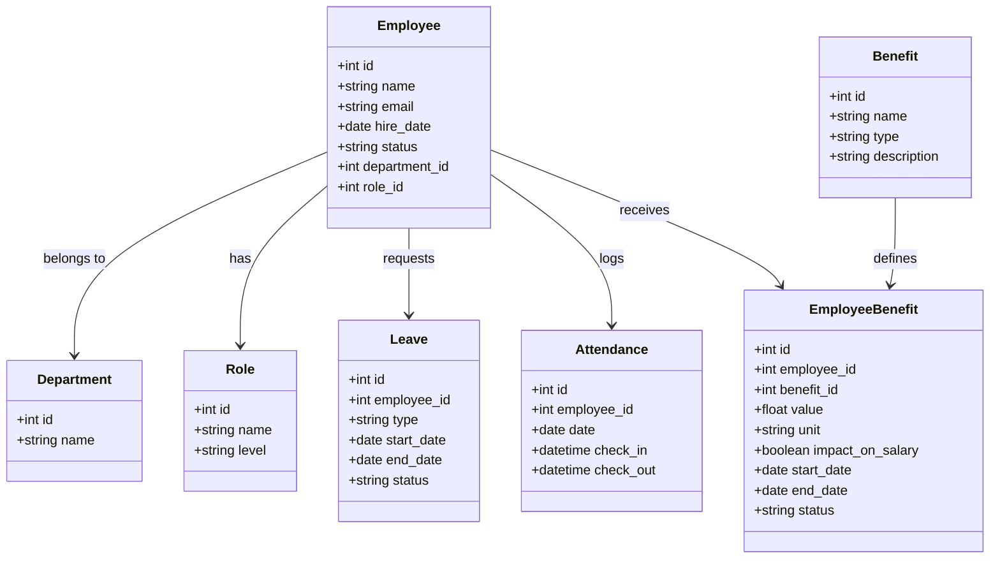

```mermaid
classDiagram

%% ======================
%% CORE ENTITIES
%% ======================

class Employee {
  +int id
  +string name
  +string email
  +date hire_date
  +string status
  +int department_id
  +int role_id
}

class Department {
  +int id
  +string name
}

class Role {
  +int id
  +string name
  +string level
}

%% ======================
%% HR OPERATIONS
%% ======================

class Leave {
  +int id
  +int employee_id
  +string type
  +date start_date
  +date end_date
  +string status
}

class Attendance {
  +int id
  +int employee_id
  +date date
  +datetime check_in
  +datetime check_out
}

%% ======================
%% BENEFITS SYSTEM
%% ======================

class Benefit {
  +int id
  +string name
  +string type
  +string description
}

class EmployeeBenefit {
  +int id
  +int employee_id
  +int benefit_id
  +float value
  +string unit
  +boolean impact_on_salary
  +date start_date
  +date end_date
  +string status
}

%% ======================
%% RELATIONSHIPS
%% ======================

Employee --> Department : belongs to
Employee --> Role : has

Employee --> Leave : requests
Employee --> Attendance : logs

Employee --> EmployeeBenefit : receives
Benefit --> EmployeeBenefit : defines
```
